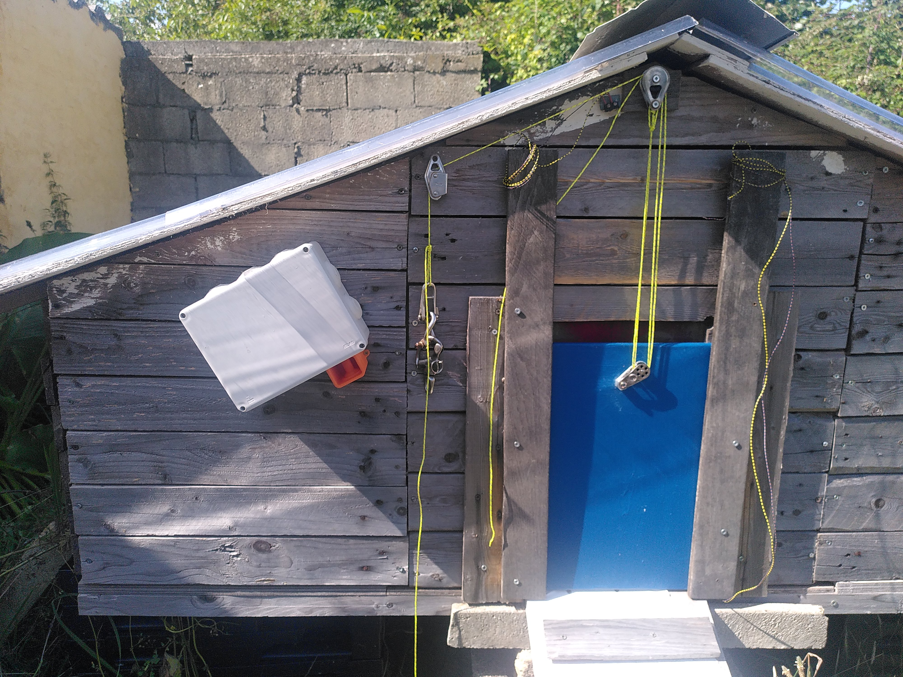

# Porte à poules


Une porte à poules est destiné à automatiser l'ouverture et la fermeture d'un poulailler. Il est équipé d'un capteur de lumière et d'une horloge en temps réel. Le déclenchement de la porte se fait donc à partir d'une certaine heure (défini par l'utilisateur au moyen de potentiomètres) et quand la lumière passe en dessous d'un certain seuil. 

Le système est réalisé sur une base arduino avec un moto-réducteur à courant continu. L'alimentation est opéré par une batterie au plomb chargé par un petit panneau solaire.



## Usage de la présente documentation

Toutes la documentation est basé sur une archive git et hébergé sur [github](https://github.com/). 

Afin de fabriquer la porte à poule et de disposer de tous les documents et fichiers nécessaires, je vous recommande de copier l'archive sur votre ordinateur : 
 - En vous rendant directement sur le projet github : https://github.com/gheleguen/porte_a_poules.
 - Ou en exécutant sur un terminal la ligne de commande suivante : ```git clone https://github.com/gheleguen/porte_a_poules```


## 1/ Toutes les clés pour se lancer

### 1.1 Télécharger l'archive

Avant toute chose, [télécharger l'archive du projet](https://github.com/gheleguen/porte_a_poules/archive/refs/heads/main.zip). C'est dans ce dossier que se trouve tous les fichiers de documantations mais aussi les fichiers de découpes ou les modèles d'impression 3D. 


**Ou passer par Git Hub**

Se rendre dans le [git hub](https://github.com/gheleguen/porte_a_poules) et télécharger l'archive complète du projet. 

**Ou en lignes de commandes**

 - Ouvrir un terminal linux,
 - Si ce n'est pas déjà fait installer ```git``` : <pre>sudo apt install git</pre>
 - Se placer dans le dossier de votre ordinateur où vous souhaitez installer enregistrer l'archive.
 - Cloner l'archive : <pre>git clone https://github.com/gheleguen/porte_a_poules</pre> 


### 1.2 L'arborescence de l'archive

 - **docs :** Est le dossier qui contient les documents et images qui constituent la documentation.  Ce sont des fichiers marckdown (.md) que l'on peut ouvrir avec un éditeur de texte.

 - **Hardware :** Le dossier qui contient les fichiers d'impressions 3D, de découpe laser...  

 - **Software :** Le dossier qui contient le code à flasher sur l'arduino.