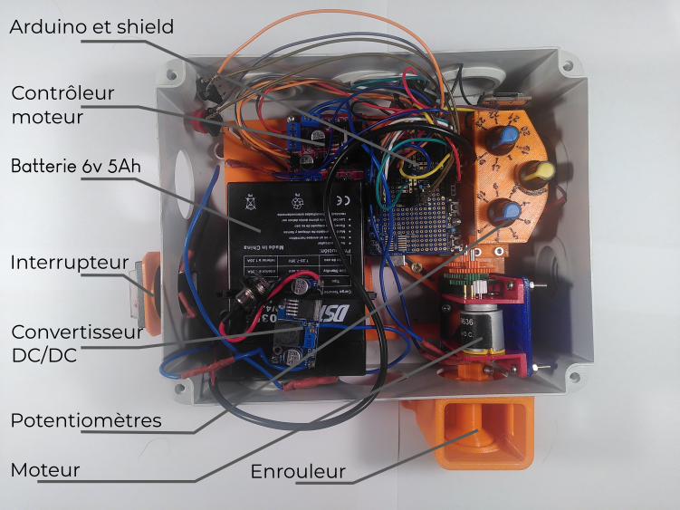
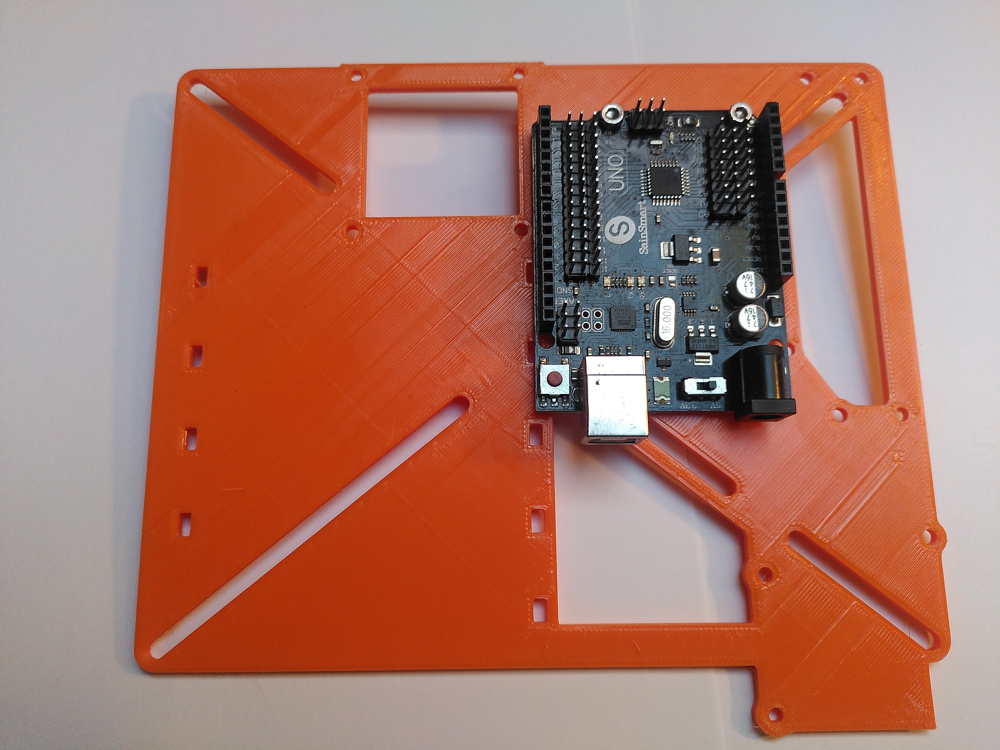
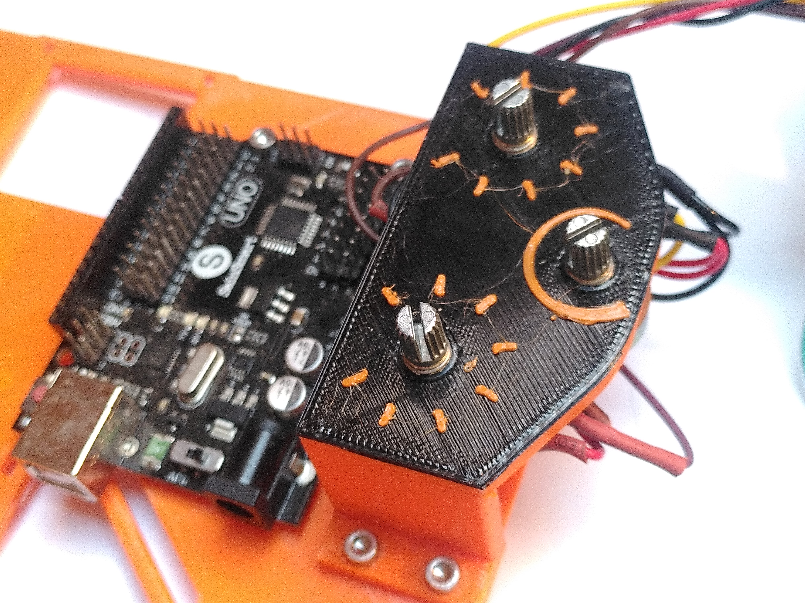
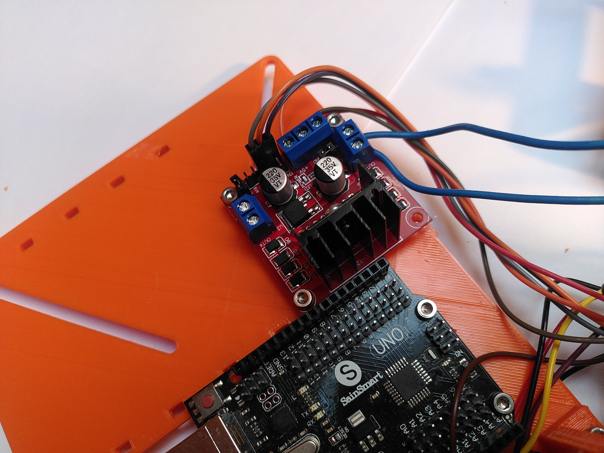
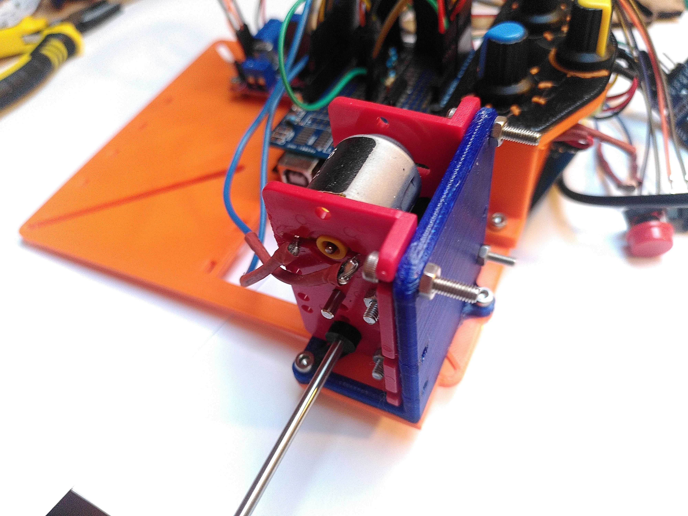
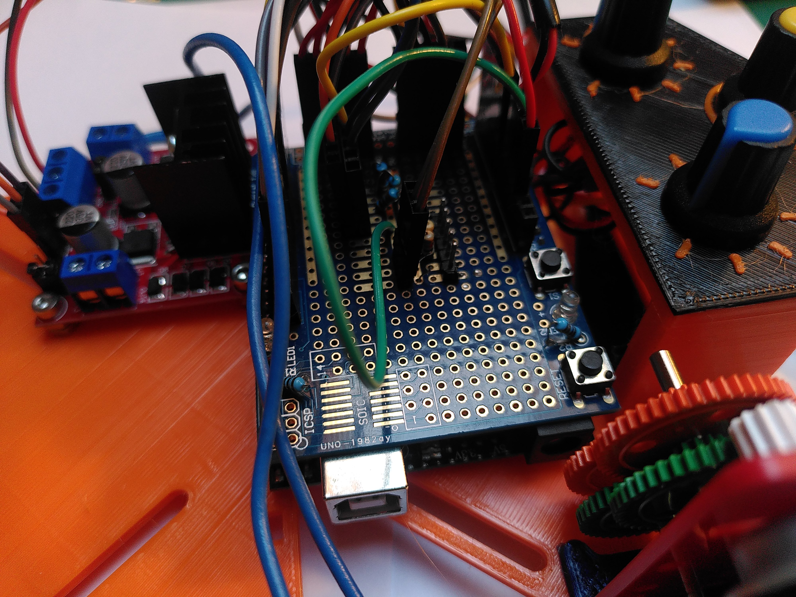

# 0.1.0 -- 3/Montage élec
## 3.1 Introduction
Le système est placé dans une boite étanche de dérivation que l'on trouve en magasin de bricolage. Des modèles 3D sont disponible dans l'archives pour imprimer en 3D les différentes pièces additionnels.

La partie ici présnete traite de l'intégration de l'électronique dans la boite de dérivation. Le résultat attendu est ceci : 

  
## 3.2 Réalisation

 - Au moyen de 4 vis M3 et de 4 écrous fixer la carte arduino sur la plaque de fixation. 

- Insérer les 3 potentiomètres dans les supports en forçant. On prendra soin de placer le potentiomètre qui sert au réglage du seuil de luminosité sur la pointe. 
 - Visser le support de potentiomètres sur la gauche de la carte arduino.

 - Insérer sur les potentiomètres la plaque avec les graduations. Sérer avec les écrous fournis avec les potentiomètres. 
 - Insérer les boutons.

 - Fixer le contrôleur du moteur à droite de la carte arduino. 

 - Visser le réducteur du moteur sur le support au moyen de 3 vis M3 et de 3 écrous.
 - Visser le support de moteur en dessous du porte potentiomètres. 

 - Installer le shild et ses câbles sur le dessus de l'Arduino en veillant à ce que les broches tombent au bon endroit. 

 - Au moyen de coliers de serrages, fixer la batterie en positionnant les connectiques vers le bas afin de limiter tout contact avec le contrôleur moteur. 
 - Les modules RTC et portes cartes SD seront maintenu au moyens de colliers de serrages. 
 - Réaliser un câblage pour alimenter le circuit et le couper au moyen de l'interrupteur. 