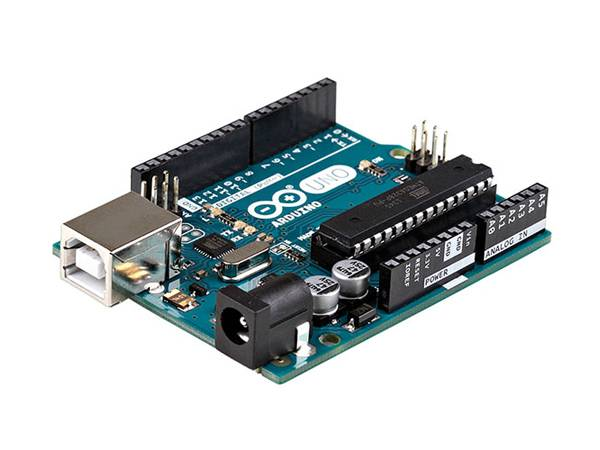

# 0.1.0 -- 1/Liste du matériel et fournitures

## 1.1 Fournitures
|Dénomination|Visuel|Où se fournir ?|Qt|
|------|------|-----|--|
|Arduino UNO||Conrad / RS components|1|
|Contrôleur moteur - Module L298N||Conrad / RS components|1|
|Moteur DC (1,5-3v et son reducteur)||RS components|1|
|Module horloge RTC DS3231||Conrad / RS components|1|
|Module porte carte SD et SDHC *notes : ce modèle contient un convertisseur de tension permettant de l'alimenter en 5V comme en 3,3v*||Conrad / RS components|1|
|Adafruit proto shield||Go tronic|1|
|Boite de dérivation ||ici : DEBFLEX IP55 718070 210*170*80mm acheté chez Leroy-merlin|1|
|Interupteur étanche KCD4||Conrad / RS components|1|
|Module abaisseur de tension LM2596S DC-DC||Conrad / RS components|1|
|Carte Micro SD||Conrad / RS components|1|
|Résistances 1Kohm ou autre valeur|||4|
|Résistances 10Kohm|||1|
|Fins de courses|||2|
|Photo-résistance|||1|
|Batterie 6V 5Ah au plomb||Conrad / RS components|1|
|Potentiomètres||Conrad / RS components|3|
|Fils de breadbord mâle-mâle et femelle-mâle||||
|Kit de connecteurs dupont|||1|
|Gaine thermo-retractable||magasin de bricolage|1|
|Jeu de cosses electriques||magasin de bricolage|1|
|Fils et câbles électrique||magasin de bricolage|1|

## 1.2 Matériel
 - Ordinateur
 - [Logiciel Arduino IDE](https://www.arduino.cc/en/software)
 - Câble USB type B vers USB
 - Pince à connecteurs dupont
 - Pince coupante
 - Pince à dénuder
 - Fer à souder
 - Etain pour soudure électronique
 - Multimètre
 - Imprimante 3D