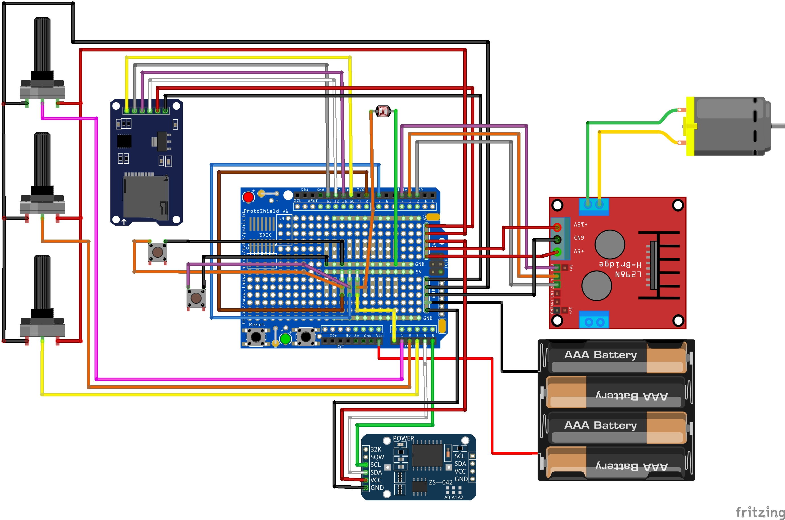

# 0.1.0 -- 2/Montage électronique
## 2.1 Introduction
La version 0.1.0 est la première version à être installé sur un poulailler. Le test a été effectué en été 2023 en Bretagne à Trégunc. 

### 2.1.1 Principe de fonctionnement
Le boitier ici présent permet d'enrouler et de dérouler une corde autour d'un tambour. Ce qui dans notre cas par un jeu de poulie, permet de lever et descendre la porte d'us poulailler. 

L'utilisateur en agissant sur les trois potentiomètres peut modifier chacun de ces trois paramètres sans intervenir sur le programme : 
 - L'heure minimum d'ouverture, 
 - L'heure minimum de fermeture,
 - Le seuil de luminosité pour le déclenchement, 

Une horloge RTC, permet de conserver l'heure et la date même hors tentions. De cette manière le système connaît l'heure réel et la date. 
Une module (lecture écriture) de carte SD permet d'écrire sur un fichier .txt des données tel que les paramètres donnés par l'utilisateur, et les heures de déclenchements de la porte. Ce fichier a pour unique vocation de simplifier le débogage.

Une photo-résistance permet de mesurer la quantité de lumière ambiante. C'est cette donnée qui sert à définir le moment où s'ouvrira ou se fermera la porte.  

Les deux boutons poussoirs ou plutôt les deux fins de courses permettent au système d'avoir l'information de la position de la porte et ainsi arrêter le moteur lorsque la porte est abaissé ou ouverte. 

Dans cette version, on utilise une batterie 6v au plomb. Elle est chargé via un panneau solaire 12v et un abaisseur de tension. Le circuit d'alimentation est détaillé dans une autre partie de ce tutoriel.

Un interrupteur disposé sur le coté permettra d'ouvrir ou fermer l'alimentation du système. 
 
### 2.1.2 Recommandations
Le circuit détaillé ci-dessous est à réaliser en veillant à garder des longueurs de câbles suffisantes. Il est également recommandé d'utiliser un kit de connecteurs duponts pour faciliter les branchements. 

Par ailleur bien consulter les autres partie du tutoriel et particulièrement la partie traitant de l'intégration. En effet la longueur des câbles nécessaires dépendra de la disposition des différents éléments dans le boitier étanche. 

</br></br> 
## 2.2 Réalisation
### 2.2.1 Câblage
Réaliser le circuit représenté ci dessous. Le fichier fritzing est disponible dans le dossier "hardware" du dépôt.

Souder sur la carte "adafruit proto shield" des résistances de tirage (symbolisés par des petits fils blanc sur le shèma reliant le 5v aux boutons poussoirs et la photo-résistance).



#### 3.1.2
 - Visser le réducteur du moteur sur le support au moyen de 3 vis M3 et de 3 écrous.
 - Insérer les 3 potentiomètres dans les supports en forçant. On prendra soin de placer le potentiomètre qui sert au réglage du seuil de luminosité sur la pointe. 
 - Visser le support de potentiomètres sur la droite, la carte arduino au centre et le contrôleur moteur à gauche. 
 - Visser le support de moteur en dessous du porte potentiomètres. 


### 2.2.2 Software
Le code suivant se trouve aussi au format ".ino" dans l'archive dans le dossier "software/_010_software/_010_software.ino".

 
 - Ouvrir le logiciel Arduino IDE. 
 - Installer les librairies "Wire.h", "DS3231.h", "SPI.h" et "SD.h"
 - Flasher  le code suivant :

```cpp
//Librairies à installer
#include <Wire.h>  
#include "DS3231.h"
#include <SPI.h>
#include <SD.h>

RTClib RTC;
DS3231 Clock;

// Branchements des composants
int enA = 4; //EnA du controleur moteur
int in1 = 3; //in1 du controleur moteur
int in2 = 2; //in2 du controleur moteur
int pin_buttonA = 7; // port numérique lié au bouton poussoir 1
int pin_buttonB = 8; // port numérique lié au bouton poussoir 2
int photoR = A0; // Port Analogique de la photo-résistance
int PotHouv = A1; //Port analogique du potentiomètre 1
int PotHferm = A3; // Port analogique du potentiomètre 2
int PotLum = A2; // Port analogique du potentiomètre 3
const int pinBranchementCS = 10; // Le « 10 » indiquant ici que la broche CS (SS) du lecteur de carte SD

//Paramètres de déclenchements de la porte
int Mouv = 0; // Minute d'ouverture
int Mferm = 0; // Minute de fermeture
int vPotHouv = 0;      // Variable où on stock la valeur du potentiomètre
int vPotHferm = 0;      // Variable où on stock la valeur du potentiomètre
int vPotLum = 0;      // Variable où on stock la valeur du potentiomètre
float Houv = 8;  // Variable où on stock l'heure d'ouverture
float Hferm = 20;  // Variable où on stock l'heure de fermeture
float LumD = 20;  // Variable où on stock le seuil de lumière qui sera utilisé
const char* nomDuFichier = "log.csv"; // Nom du log sur carte SD
File monFichier;

//Introduction de variables
int Year;
int Month;
int Date;
int Hour;
int Minute;
int Second;
int interval = 1;
int Minute_last;
int Date_last;
int i;  //i permettra à l'arduino de savoir si il fait jour ou nuit
int PR; // Varible qui stockera la valeur de la photorésistance


void setup()
{
  Serial.begin(9600); //Initialise le moniteur série
  Wire.begin(); //Initialisation du bus I2C
  SD.begin(pinBranchementCS); // démarre le lecteur de carte SD
  
  // Defini tous les ports du controleur moteur comme des sorties
  pinMode(enA, OUTPUT);
  pinMode(in1, OUTPUT);
  pinMode(in2, OUTPUT);
  analogWrite(enA, 255); 
  DateTime now = RTC.now();
  Minute = now.minute();
  
  // cette fonction va permettre de determiner si il fait jour ou si il fait nuit et de définir i en conséquence. 
  if (Hour >= Houv && Hour <Hferm) {
    i = 1 ; // I prend 1 ce qui veut dire qu'il fait jour
  }
  else {
    i = 0 ; // I prend 0 ce qui veut dire qu'il fait nuit
  }
}
void loop()
{  
  delay(1000);
  PR = analogRead(photoR); // On lit la valeur de la photo-resistance
  vPotHouv = analogRead(PotHouv); // on lit la valeur du potentiometre 1 
  vPotHferm = analogRead(PotHferm); // on lit la valeur du potentiometre 2
  vPotLum = analogRead(PotLum); // on lit la valeur du potentiometre 3
  Houv = ((vPotHouv*7.00/1023.00)+3); // Calcul de l'heure d'ouverture
  Hferm = ((vPotHferm*7.00/1023.00)+16); // Calcul de l'heure de fermeture
  LumD = ((vPotLum*1000.00/1023.00)); // Calcul du seuil de luminosité 
  affichage();
  
  if (Hour >= Houv && Hour < Hferm && i == 0 && PR > LumD) { // Si l'heure est supérieur à l'heure minimale d'ouverture et que la porte est fermé
      ouverture(); // Ouverture de la porte
   }
  if (Hour >= Hferm && Hour > Houv && i == 1 && PR < LumD) { // Si l'heure est supérieur à l'heure minimale de fermeture et que la porte est fermé
      fermeture(); // Ouverture de la porte
   }
  DateTime now = RTC.now();
  Year = now.year();
  Month = now.month();
  Date = now.day();
  Hour = now.hour();
  Minute = now.minute();
  Second = now.second();
}

// Fonction permettant l'ouverture de la porte
void ouverture(){
  monFichier = SD.open(nomDuFichier, FILE_WRITE);
  if (monFichier) {
    monFichier.print("ouverture");
    monFichier.print(";");
    monFichier.print(Year);
    monFichier.print("-");
    monFichier.print(Month);
    monFichier.print("-");
    monFichier.print(Date);
    monFichier.print(";");
    monFichier.print(Hour);
    monFichier.print(":");
    monFichier.print(Minute);
    monFichier.print(";");
    monFichier.print(Houv);
    monFichier.print(";");
    monFichier.print(Hferm);
    monFichier.print(";");
    monFichier.println(PR);
    monFichier.close(); // Fermeture du fichier
    Serial.println("Ecriture terminee.");
  }
  else {
    Serial.println(F("Echec d'ouverture en ecriture, sur la carte SD !"));
  }
  Serial.println();
  Serial.print("Ouverture de la porte...");
  while (digitalRead(pin_buttonA) == HIGH){ // Tant que le bouton est en position High, le moteur tourne
      //le moteur tourne
      digitalWrite(in1, HIGH);
      digitalWrite(in2, LOW);
  }
  Serial.println();
  Serial.print("Porte ouverte ;-)");
  digitalWrite(in1, LOW);
  digitalWrite(in2, LOW);
  i = 1; // I defini l'etat d'ouverture de la porte, ici i prend la valeur 1 ce qui signifie que la porte est ouverte
  delay(1000);
}

// Fonction permettant la fermeture de la porte
void fermeture(){
    monFichier = SD.open(nomDuFichier, FILE_WRITE);
  if (monFichier) {
    monFichier.print("fermeture");
    monFichier.print(";");
    monFichier.print(Year);
    monFichier.print("-");
    monFichier.print(Month);
    monFichier.print("-");
    monFichier.print(Date);
    monFichier.print(";");
    monFichier.print(Hour);
    monFichier.print(":");
    monFichier.print(Minute);
    monFichier.print(";");
    monFichier.print(Houv);
    monFichier.print(";");
    monFichier.print(Hferm);
    monFichier.print(";");
    monFichier.println(PR);
    monFichier.close(); // Fermeture du fichier
    Serial.println("Ecriture terminee.");
  }
  else {
    Serial.println(F("Echec d'ouverture en ecriture, sur la carte SD !"));
  }
  Serial.println();
  Serial.print("Fermeture de la porte...");
  while (digitalRead(pin_buttonB) == HIGH){ // Tant que le bouton est en position High, le moteur tourne
      //le moteur tourne
      digitalWrite(in1, LOW);
      digitalWrite(in2, HIGH);
  }
  Serial.println();
  Serial.print("Porte ferme ;-)");
  digitalWrite(in1, LOW);
  digitalWrite(in2, LOW);
  i = 0;
  delay(1000);
}

// Fonction permettant l'affichage des données sur le moniteur serie
void affichage() {
  Serial.println();
  Serial.print("Date: ");
  Serial.print(Year);
  Serial.print("/");
  Serial.print(Month);
  Serial.print("/");
  Serial.print(Date);
  Serial.print(" ");
  Serial.print(Hour);
  Serial.print(":");
  Serial.print(Minute);
  Serial.print(":");
  Serial.print(Second);
  Serial.println();
  Serial.print("Parametres: ");
  Serial.print(Houv);
  Serial.print("  ");
  Serial.print(Hferm);
  Serial.print("  ");
  Serial.print(LumD);
  Serial.println();
  Serial.print("Valeur actuel de la Photo-resistance : ");
  Serial.println(PR);
  Serial.print("Valeur de i : ");
  Serial.println(i);
}
```


</br></br>
## 2.3 Améliorations envisageables
 - Ajouter un écran LCD pour donner l'heure des dernières ouvertures, fermetures et valeur de lumière. 
 - Si la lecture de l'intensité lumineuse pose un problème, peut-être étudier des techniques de lissage de courbe tel qu'utiliser une moyenne glissante, [comme documenté ici](https://www.aranacorp.com/fr/implementation-de-la-moyenne-glissante-dans-arduino/#:~:text=Le%20principe%20de%20la%20moyenne,l'%C3%A9tablissement%20de%20la%20moyenne.).
