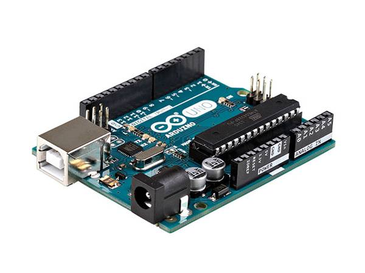
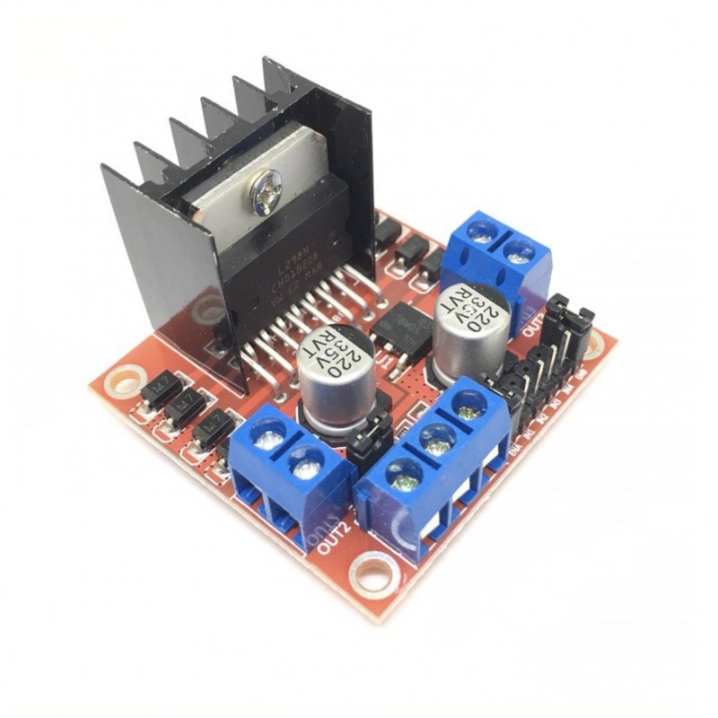
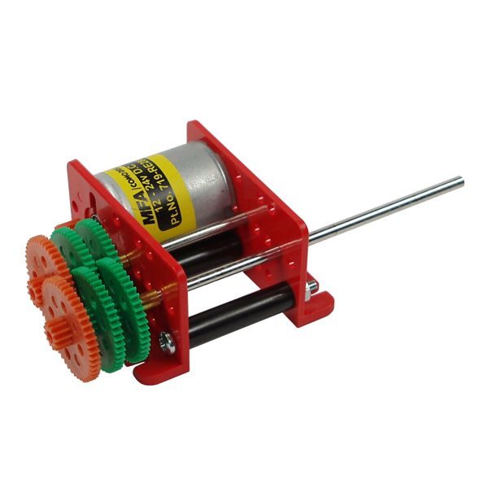
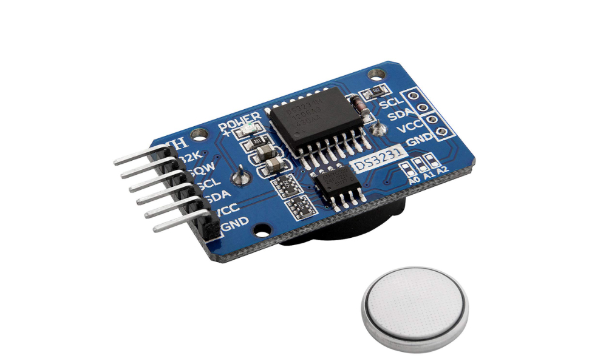
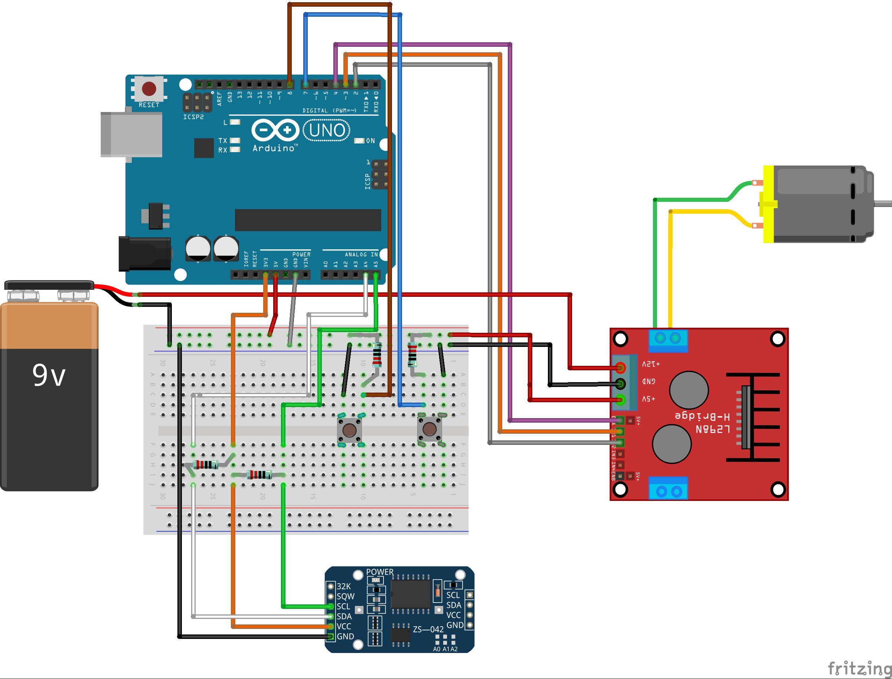

# 0.0.1 -- Un moteur piloté à l'heure
## 1/ Introduction
La première étape du développement de cet outil est de chercher à piloter un moteur à courant continu de 1,5 à 3V au moyen d'une arduino UNO et d'une RTC pour donner l'heure. 
 - Dans cette configuration 2 boutons poussoirs symbolisent, les deux fins de courses. Le moteur devra s'arrêté lorsque le bouton sera enclenché de fin de course correspondant sera enclenché.
 - Une RTC permettra de fournir l'heure en temps réel. Cette donnée permet à la porte de s'ouvrir et de se fermer. 

</br></br>
## 2/ Matériel et fournitures nécessaire
### 2.1 Fournitures
|Dénomination|Visuel|Où se fournir ?|Qt|
|------|------|-----|--|
|Arduino UNO||Conrad / RS components|1|
|Contrôleur moteur - Module L298N||Conrad / RS components|1|
|Moteur DC (1,5-3v et son reducteur)||RS components|1|
|Module horloge RTC DS3231||Conrad / RS components|1|
|Résistances 1Kohm ou autre valeur|||4|
|Boutons poussoirs|||2|
|Batterie 5-6V ou Bloc piles 4* AA et piles||Conrad / RS components|1|
|Breadbord|||1|
|Fils de breadbord mâle-mâle et femelle-mâle||||

### 2.2 Matériel
 - Ordinateur
 - [Logiciel Arduino IDE](https://www.arduino.cc/en/software)
 - Câble USB type B vers USB. 

</br></br> 
## 3/ Réalisation
### 3.1 Hardware
Réaliser le circuit représenté ci dessous. [Le fichier fritzing est accessible ici](../hardware)


### 3.2 Software
Le code suivant se trouvau aussi au format ".ino" dans l'archive dans le dossier "software" sous le nom de "dev_mot_et_rtc.ino".

Flasher au moyen d'Arduino IDE le code suivant :

```cpp
#include <Wire.h>  
#include "DS3231.h"

RTClib RTC;
DS3231 Clock;

//Paramètres de déclenchements de la porte
int Houv = 8; // Heure d'ouverture
int Mouv = 0; // Minute d'ouverture
int Hferm = 17; //Heure de fermeture
int Mferm = 0; // Minute de fermeture

// Branchements
int enA = 4; 
int in1 = 3;
int in2 = 2;
int pin_buttonA = 7; // port numérique lié au bouton poussoir 1
int pin_buttonB = 8; // port numérique lié au bouton poussoir 2

//Introduction de variables
int Year;
int Month;
int Date;
int Hour;
int Minute;
int Second;
int interval = 1;
int Minute_last;
int Date_last;
int i = 0;


void setup()
{
  //Initialise le moniteur série
  Serial.begin(9600);
  Wire.begin(); //for DS3231 for RTC
  
  // Defini tous les ports du contr^leur moteur comme des sorties
  pinMode(enA, OUTPUT);
  pinMode(in1, OUTPUT);
  pinMode(in2, OUTPUT);
  analogWrite(enA, 255); 
  DateTime now = RTC.now();
  Minute = now.minute();
}
 
void loop()
{  
  delay(1000);
  Serial.println();
  Serial.print(Year);
  Serial.print("/");
  Serial.print(Month);
  Serial.print("/");
  Serial.print(Date);
  Serial.print(" ");
  Serial.print(Hour);
  Serial.print(":");
  Serial.print(Minute);
  Serial.print(":");
  Serial.print(Second);
  if (Hour >= Houv && Hour < Hferm && i == 0) { // Si l'heure est supérieur à l'heure minimale d'ouverture et que la porte est fermé
      ouverture(); // Ouverture de la porte
   }
  if (Hour >= Hferm && Hour > Houv && i == 1) { // Si l'heure est supérieur à l'heure minimale de fermeture et que la porte est fermé
      fermeture(); // Ouverture de la porte
   }
  DateTime now = RTC.now();
  Year = now.year();
  Month = now.month();
  Date = now.day();
  Hour = now.hour();
  Minute = now.minute();
  Second = now.second();
}

void ouverture(){
  Serial.println();
  Serial.print("Ouverture de la porte...");
  while (digitalRead(pin_buttonA) == HIGH){ // Tant que le bouton est en position High, le moteur tourne
      //le moteur tourne
      digitalWrite(in1, HIGH);
      digitalWrite(in2, LOW);
  }
  Serial.println();
  Serial.print("Porte ouverte ;-)");
  digitalWrite(in1, LOW);
  digitalWrite(in2, LOW);
  i = 1; // I defini l'etat d'ouverture de la porte, ici i prend la valeur 1 ce qui signifie que la porte est ouverte
  delay(1000);
}

void fermeture(){
  Serial.println();
  Serial.print("Fermeture de la porte...");
  while (digitalRead(pin_buttonB) == HIGH){ // Tant que le bouton est en position High, le moteur tourne
      //le moteur tourne
      digitalWrite(in1, LOW);
      digitalWrite(in2, HIGH);
  }
  Serial.println();
  Serial.print("Porte ferme ;-)");
  digitalWrite(in1, LOW);
  digitalWrite(in2, LOW);
  i = 0;
  delay(1000);
}
```

</br></br>
## 4/ Références et développement. 
J'ai commencé par tester des codes proposé sur le web. Mais tous me rendent des erreurs lié à des librairies.
 - [Ce Tutoriel est réalisé à partir d'un L298N](https://www.instructables.com/Chicken-Coop-Door-Arduino-Based/). Son code ne fonctionne pas du fait d'erreur sur les librairies.
 - [Ce dépot Git Hub peut être intéréssant aussi](https://github.com/chrisuthe/CoopDoor/tree/master/ChickenDoorController) mais comme le précédent il ne fonctionne pas. 

J'ai donc décidé de coder le système moi même :
 - Je suis partis du Tutoriel ci attaché pour faire tourner le moteur[Code et branchements pour faire tourner un moteur avec L298N](https://www.robotique.tech/tutoriel/commander-un-moteur-par-arduino-et-le-module-l298n/). Je suis ainsi parti de ce petit code qui permet de faire tourner le moteur dans un sens puis dans l'autre : 
 ```cpp
// connect motor controller pins to Arduino digital pins
// motor one
int enA = 4;
int in1 = 3;
int in2 = 2;
void setup()
{
  //Initialize Serial Monitor
  Serial.begin(9600);
  // set all the motor control pins to outputs
  pinMode(enA, OUTPUT);
  pinMode(in1, OUTPUT);
  pinMode(in2, OUTPUT);
  analogWrite(enA, 255); 
}
 
void loop()
{  
  //le moteur tourne
  digitalWrite(in1, HIGH);
  digitalWrite(in2, LOW);
  delay(2000);
  //stop le moteur
  digitalWrite(in1, LOW);
  digitalWrite(in2, LOW);
  delay(1000);
  //le moteur tourne dans le sens inverse
  digitalWrite(in1, LOW);
  digitalWrite(in2, HIGH);
  delay(2000);
  //stop le moteur
  digitalWrite(in1, LOW);
  digitalWrite(in2, LOW);
  delay(1000);
} 
 ```

 - J'ai ajouté un bouton poussoir pour le faire tourner jusqu'à ce qu'un bouton soit enfoncé. [J'ai pour cela suivi ce guide de branchement](https://arduino.blaisepascal.fr/le-bouton-poussoir/) et utilisé la ligne de code suivante : 
 
 ```cpp
 if (digitalRead(pin_button) == HIGH) { // si le bouton est pressé ...
      state = !state; // ... inversion de la variable d'état de la LED (allumée<->éteinte)
   }
 ```
  - Sans oublier de déclarer avant le ```void setup() ``` la variable 
  ```cpp
  int pin_button = 2; // port numérique lié au bouton poussoir
  ```
 - Puis j'ai ajouté la RTC, Pour la brancher, j'ai [consulté ce tutoriel](https://arduino-france.site/i2c-scanner/) qui m'a permis de brancher correctement l'I2C sur l'Arduino

|Capteur I2C|Uno|Nano|Mega|
|------|------|------|------|
|GND|GND|GND|GND|
|VCC|3,3v|3,3v|3,3v|
|SDA|A4|A4|20|
|SCL|A5|A5|21|

 - La gestion de l'horloge est obtenu en introduisant les librairies et variables suivantes :

```cpp
#include <Wire.h> // for SD stock
#include "DS3231.h" // for rtc

RTClib RTC;
DS3231 Clock;

int Year;
int Month;
int Date;
int Hour;
int Minute;
int Second;
int interval = 1;
int Minute_last;
int Date_last;
```

 - Puis en définissant l'heure dans le setup : 

```cpp
  DateTime now = RTC.now();
```
 - Et enfin à chaque boucle du loop, on modifie ces variables : 

```cpp
  DateTime now = RTC.now();
  Year = now.year();
  Month = now.month();
  Date = now.day();
  Hour = now.hour();
  Minute = now.minute();
  Second = now.second();
```

 - J'ai mis à l'heure mon horloge en utilisant le code ci dessous. 

```cpp
// Horloge_reglage_heure
// Appel de la bibliothèque
#include <Wire.h>
// Adresse I2C de l'horloge en temps réel
#define ADRESSE_I2C_RTC 0x68
// Indiquez ici l'heure et la date :
byte heure = 00; // 0 à 23
byte minute = 20; // 0 à 59
byte seconde = 0; // 0 à 59
byte numJourSemaine = 3; // dim = 1, sam = 7
byte numJourMois = 2; // 1 à 31
byte mois = 5; // 1 à 12
byte annee = 23; // 0 à 99
void setup(){
Wire.begin();
// Change l'heure et la date de l'horloge en temps réel
Wire.beginTransmission(ADRESSE_I2C_RTC);
Wire.write(0); // Positionner le pointeur de registre sur 00h
Wire.write(decToBcd(seconde));
Wire.write(decToBcd(minute));
Wire.write(decToBcd(heure));
Wire.write(decToBcd(numJourSemaine));
Wire.write(decToBcd(numJourMois));
Wire.write(decToBcd(mois));
Wire.write(decToBcd(annee));
Wire.endTransmission();
}
void loop(){
}
// Convertir les nombres décimaux normaux en décimaux codés binaires
byte decToBcd(byte val){return( (val/10*16) + (val%10));}
```
 - Si ce dernier ne fonctionne pas, c'est probablement que l'adresse I2C n'est pas la bonne. Utiliser un code de détection de port pour y parvenir. Ouvrir le moniteur série. L'adresse retourné par ce programme permettra de remplacer ```0x68``` dans le programme précédent à la ligne ```#define ADRESSE_I2C_RTC 0x68```

```cpp
/*=================================================================
Ce sketch est un scanner I2C: il essaye de communiquer avec toutes 
les adresses I2C possibles et affiche celle(s) qui réponde(nt).
  
                      BRANCHEMENT
* Pin SCD du moule à scanner  ----------->  SCD de l’Arduino
* Pin SDA du moule à scanner  ----------->  SDA de l’Arduino
================================================================ */

#include <Wire.h>
void setup()
{
  Wire.begin();
  Serial.begin(9600);
  Serial.println("\nI2C Scanner");
}

void loop()
{
  byte error, address;
  int nDevices;
  Serial.println("Recherche en cours...");
  nDevices = 0;
  for(address = 1; address < 127; address++ ) 
  {
    Wire.beginTransmission(address);
    error = Wire.endTransmission();

    if (error == 0)
    {
      Serial.print("Equiment I2C trouve a l'addresse 0x");
      if (address<16) 
        Serial.print("0");
      Serial.print(address,HEX);
      Serial.println("  !");
      nDevices++;
    }
    else if (error==4)
    {
      Serial.print("Erreur inconnue a l'address 0x");
      if (address<16) 
        Serial.print("0");
      Serial.println(address,HEX);
    }    
  }
  if (nDevices == 0)
    Serial.println("Aucun Equipement I2C trouve\n");
  else
    Serial.println("Fini\n");

  delay(5000);           
}
```

</br></br>
## 5/ Améliorations
 - Ajouter carte SD pour stocker les données de commandes d'horaire. Ce qui veut dire que les variables devront être lu dans un fichier qui se trouvera dans la SD carte. 
