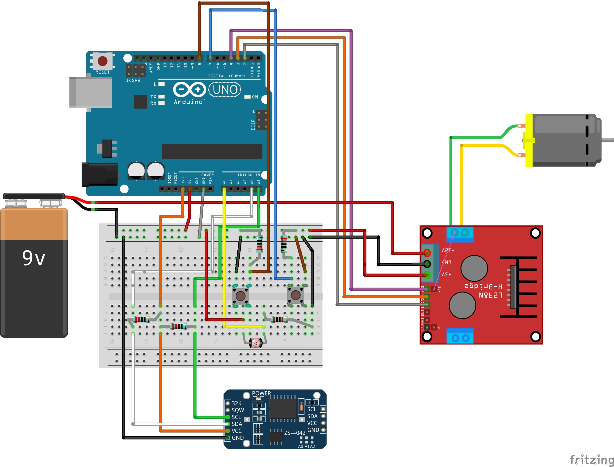
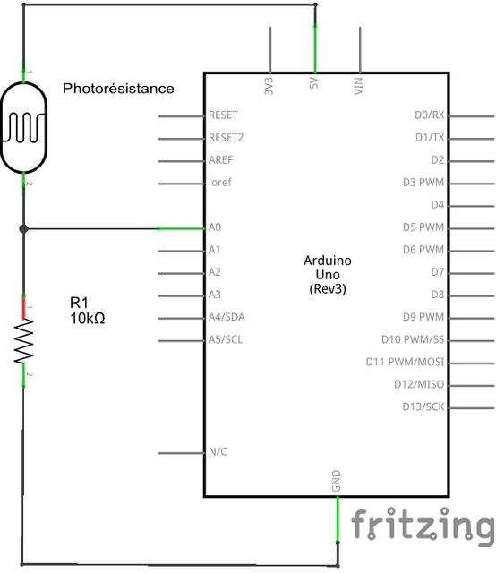

# 0.0.2 -- Ajout d'un capteur de lumière 
## 1/ Introduction
Seconde étape, insérer à notre système une lecture de l'intensité lumineuse ambiante. 
 - Ajouter une photo résistance
 - Il devra y avoir des heures de sécurité pour que même si la lumière augmente en peine nuit (lampe torche), la porte reste fermé.

</br></br>
## 2/ Matériel et fournitures nécessaire
### 2.1 Fournitures
|Dénomination|Visuel|Où se fournir ?|Qt|
|------|------|-----|--|
|Arduino UNO||Conrad / RS components|1|
|Contrôleur moteur - Module L298N||Conrad / RS components|1|
|Moteur DC (1,5-3v et son reducteur)||RS components|1|
|Module horloge RTC DS3231||Conrad / RS components|1|
|Résistances 1Kohm ou autre valeur|||4|
|Résistances 10Kohm|||1|
|Boutons poussoirs|||2|
|Photo-résistance|||1|
|Batterie 9V ou Bloc piles 9v et pile||Conrad / RS components|1|
|Breadbord|||1|
|Fils de breadbord mâle-mâle et femelle-mâle||||

### 2.2 Matériel
 - Ordinateur
 - [Logiciel Arduino IDE](https://www.arduino.cc/en/software)
 - Câble USB type B vers USB. 

</br></br>
## 3/ Réalisation
### 3.1 Hardware
Réaliser le circuit représenté ci dessous. Le fichier fritzing est disponible dans le dossier "hardware" du dépôt.


### 3.2 Software
Le code suivant se trouv aussi au format ".ino" dans l'archive dans le dossier "software" sous le nom de "dev_mot_et_rtc.ino".

Flasher au moyen d'Arduino IDE le code suivant :

```cpp
#include <Wire.h>  
#include "DS3231.h"

RTClib RTC;
DS3231 Clock;

//Paramètres de déclenchements de la porte
int Houv = 8; // Heure d'ouverture
int Mouv = 0; // Minute d'ouverture
int Hferm = 17; //Heure de fermeture
int Mferm = 0; // Minute de fermeture

// Branchements
int enA = 4; 
int in1 = 3;
int in2 = 2;
int pin_buttonA = 7; // port numérique lié au bouton poussoir 1
int pin_buttonB = 8; // port numérique lié au bouton poussoir 2
int photoR = A0; // Port Analogique de la photo-résistance

//Introduction de variables
int Year;
int Month;
int Date;
int Hour;
int Minute;
int Second;
int interval = 1;
int Minute_last;
int Date_last;
int i = 1; //i prend la valeur 1 soit la porte est ouverte (souvent l'installation se fera plutôt en journée)
int PR; // Varible qui stockera la valeur de la photorésistance


void setup()
{
  //Initialise le moniteur série
  Serial.begin(9600);
  Wire.begin(); //for DS3231 for RTC
  
  // Defini tous les ports du contr^leur moteur comme des sorties
  pinMode(enA, OUTPUT);
  pinMode(in1, OUTPUT);
  pinMode(in2, OUTPUT);
  analogWrite(enA, 255); 
  DateTime now = RTC.now();
  Minute = now.minute();
}
 
void loop()
{  
  delay(1000);
  PR = analogRead(photoR);
  Serial.println();
  Serial.print(Year);
  Serial.print("/");
  Serial.print(Month);
  Serial.print("/");
  Serial.print(Date);
  Serial.print(" ");
  Serial.print(Hour);
  Serial.print(":");
  Serial.print(Minute);
  Serial.print(":");
  Serial.print(Second);
  Serial.println();
  Serial.println(PR);
  if (Hour >= Houv && Hour < Hferm && i == 0 && PR > 900) { // Si l'heure est supérieur à l'heure minimale d'ouverture et que la porte est fermé
      ouverture(); // Ouverture de la porte
   }
  if (Hour >= Hferm && Hour > Houv && i == 1 && PR < 850) { // Si l'heure est supérieur à l'heure minimale de fermeture et que la porte est fermé
      fermeture(); // Ouverture de la porte
   }
  DateTime now = RTC.now();
  Year = now.year();
  Month = now.month();
  Date = now.day();
  Hour = now.hour();
  Minute = now.minute();
  Second = now.second();
}

void ouverture(){
  Serial.println();
  Serial.print("Ouverture de la porte...");
  while (digitalRead(pin_buttonA) == HIGH){ // Tant que le bouton est en position High, le moteur tourne
      //le moteur tourne
      digitalWrite(in1, HIGH);
      digitalWrite(in2, LOW);
  }
  Serial.println();
  Serial.print("Porte ouverte ;-)");
  digitalWrite(in1, LOW);
  digitalWrite(in2, LOW);
  i = 1; // I defini l'etat d'ouverture de la porte, ici i prend la valeur 1 ce qui signifie que la porte est ouverte
  delay(1000);
}

void fermeture(){
  Serial.println();
  Serial.print("Fermeture de la porte...");
  while (digitalRead(pin_buttonB) == HIGH){ // Tant que le bouton est en position High, le moteur tourne
      //le moteur tourne
      digitalWrite(in1, LOW);
      digitalWrite(in2, HIGH);
  }
  Serial.println();
  Serial.print("Porte ferme ;-)");
  digitalWrite(in1, LOW);
  digitalWrite(in2, LOW);
  i = 0;
  delay(1000);
}
```


</br></br>
## 4/ Références et développement. 
Je me suis servi de [ce tutoriel](https://www.carnetdumaker.net/articles/mesurer-la-luminosite-ambiante-avec-une-photoresistance-et-une-carte-arduino-genuino/). Le branchement est celui d'un diviseur de tension (2 résistances). </br></br>
*crédit : © TamiaLab 2016*

Pour brancher la photorésistance et la tester au moyen du code suivant : 
```cpp
/*
 * Code d'exemple pour une photorésistance.
 */

// Fonction setup(), appelée au démarrage de la carte Arduino
void setup() {

  // Initialise la communication avec le PC
  Serial.begin(9600);
}

// Fonction loop(), appelée continuellement en boucle tant que la carte Arduino est alimentée
void loop() {
  
  // Mesure la tension sur la broche A0
  int valeur = analogRead(A0);
  
  // Envoi la mesure au PC pour affichage et attends 250ms
  Serial.println(valeur);
  delay(250);
}
```

</br></br>
## 5/ Améliorations
 - Ajouter un module de carte SD qui contiendra les valeurs des variables. Pour ne pas avoir à flasher la carte pour chaque besoin. 
 - Ajouter un écran LCD pour donner l'heure des dernières ouvertures, fermetures et valeur de lumière. 
 - Pour le contrôle utilisateur, utiliser 3 potentiomètre que l'on pourra graduer. 2 pour les bornes d'heures et 1 pour la limite de déclenchement (graduer avec un petit soleil et une lune). 
 - Si la lecture de l'intensité lumineuse pose un problème, peut-être étudier des techniques de lissage de courbe tel qu'utiliser une moyenne glissante, [comme documenté ici](https://www.aranacorp.com/fr/implementation-de-la-moyenne-glissante-dans-arduino/#:~:text=Le%20principe%20de%20la%20moyenne,l'%C3%A9tablissement%20de%20la%20moyenne.).
