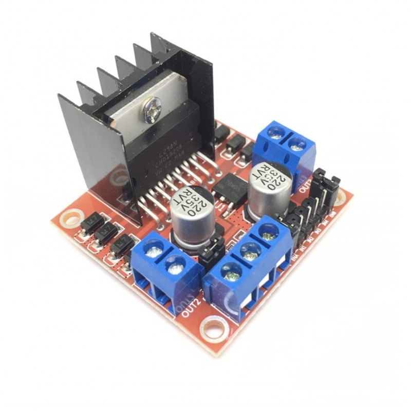
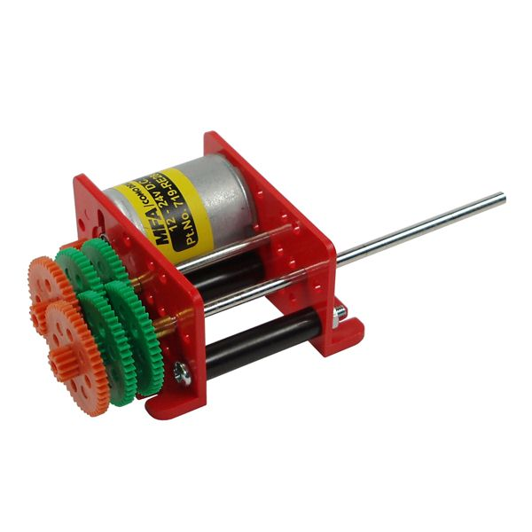
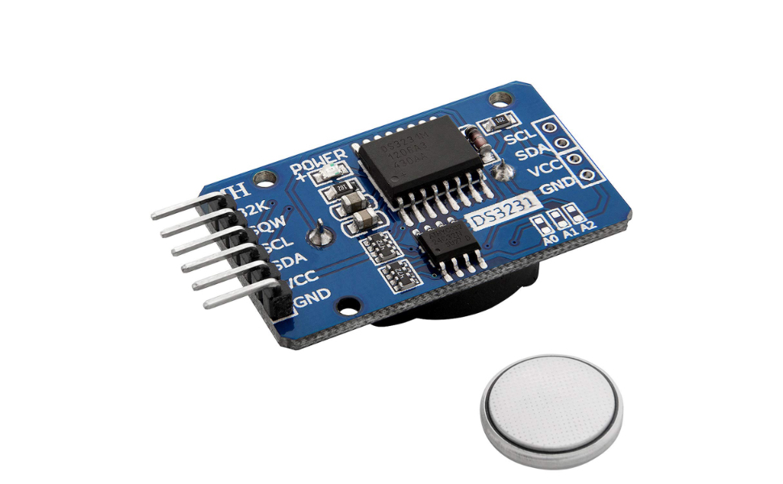

# 0.0.3 -- Trois potentiomètres pour permettre à l'utilisateur de faire les réglages
Troisième étape, insérer à notre système un moyen pour l'utilisateur de régler les paramètres. 
 - 3 potentiomètres (2 pour l'heure d'ouverture et de fermeture / 1 pour le seuil de lumière)

</br></br>
## 2/ Matériel et fournitures nécessaire
### 2.1 Fournitures
|Dénomination|Visuel|Où se fournir ?|Qt|
|------|------|-----|--|
|Arduino UNO||Conrad / RS components|1|
|Contrôleur moteur - Module L298N||Conrad / RS components|1|
|Moteur DC (1,5-3v et son reducteur)||RS components|1|
|Module horloge RTC DS3231||Conrad / RS components|1|
|Résistances 1Kohm ou autre valeur|||4|
|Résistances 10Kohm|||1|
|Boutons poussoirs|||2|
|Photo-résistance|||1|
|Batterie 5-6V ou Bloc piles 4* AA et piles||Conrad / RS components|1|
|Potentiomètres||Conrad / RS components|3|
|Breadbord|||1|
|Fils de breadbord mâle-mâle et femelle-mâle||||

### 2.2 Matériel
 - Ordinateur
 - [Logiciel Arduino IDE](https://www.arduino.cc/en/software)
 - Câble USB type B vers USB. 
 
</br></br>
## 3/ Réalisation
### 3.1 Hardware
Réaliser le circuit représenté ci dessous. Le fichier fritzing est disponible dans le dossier "hardware" du dépôt.


### 3.2 Software
Le code suivant se trouv aussi au format ".ino" dans l'archive dans le dossier "software" sous le nom de "dev_mot_et_rtc.ino".

Flasher au moyen d'Arduino IDE le code suivant :

```cpp
//Librairies
#include <Wire.h>  
#include "DS3231.h"

//Librairies
#include <Wire.h>  
#include "DS3231.h"

RTClib RTC;
DS3231 Clock;

// Branchements des composants
int enA = 4; //EnA du controleur moteur
int in1 = 3; //in1 du controleur moteur
int in2 = 2; //in2 du controleur moteur
int pin_buttonA = 7; // port numérique lié au bouton poussoir 1
int pin_buttonB = 8; // port numérique lié au bouton poussoir 2
int photoR = A0; // Port Analogique de la photo-résistance
int PotHouv = A1; //Port analogique du potentiomètre 1
int PotHferm = A2; // Port analogique du potentiomètre 2
int PotLum = A3; // Port analogique du potentiomètre 3

//Paramètres de déclenchements de la porte
int Mouv = 0; // Minute d'ouverture
int Mferm = 0; // Minute de fermeture
int vPotHouv = 0;      // Variable où on stock la valeur du potentiomètre
int vPotHferm = 0;      // Variable où on stock la valeur du potentiomètre
int vPotLum = 0;      // Variable où on stock la valeur du potentiomètre
float Houv = 8;  // Variable où on stock l'heure d'ouverture
float Hferm = 20;  // Variable où on stock l'heure de fermeture
float LumD = 20;  // Variable où on stock le seuil de lumière qui sera utilisé

//Introduction de variables
int Year;
int Month;
int Date;
int Hour;
int Minute;
int Second;
int interval = 1;
int Minute_last;
int Date_last;
int i;  //i permettra à l'arduino de savoir si il fait jour ou nuit
int PR; // Varible qui stockera la valeur de la photorésistance


void setup()
{
  Serial.begin(9600); //Initialise le moniteur série
  Wire.begin(); //Initialisation du bu I2C
  
  // Defini tous les ports du controleur moteur comme des sorties
  pinMode(enA, OUTPUT);
  pinMode(in1, OUTPUT);
  pinMode(in2, OUTPUT);
  analogWrite(enA, 255); 
  DateTime now = RTC.now();
  Minute = now.minute();
  
  // cette fonction va permettre de determiner si il fait jour ou si il fait nuit et de définir i en conséquence. 
  if (Hour >= Houv && Hour <Hferm) {
    i = 1 ; // I prend 1 ce qui veut dire qu'il fait jour
  }
  else {
    i = 0 ; // I prend 0 ce qui veut dire qu'il fait nuit
  }
}
void loop()
{  
  delay(1000);
  PR = analogRead(photoR); // On lit la valeur de la photo-resistance
  vPotHouv = analogRead(PotHouv); // on lit la valeur du potentiometre 1 
  vPotHferm = analogRead(PotHferm); // on lit la valeur du potentiometre 2
  vPotLum = analogRead(PotLum); // on lit la valeur du potentiometre 3
  Houv = ((vPotHouv*7.00/1023.00)+3); // Calcul de l'heure d'ouverture
  Hferm = ((vPotHferm*8.00/1023.00)+15); // Calcul de l'heure de fermeture
  LumD = ((vPotLum*400.00/1023.00)+623); // Calcul du seuil de luminosité 
  affichage();
  
  if (Hour >= Houv && Hour < Hferm && i == 0 && PR > LumD) { // Si l'heure est supérieur à l'heure minimale d'ouverture et que la porte est fermé
      ouverture(); // Ouverture de la porte
   }
  if (Hour >= Hferm && Hour > Houv && i == 1 && PR < LumD) { // Si l'heure est supérieur à l'heure minimale de fermeture et que la porte est fermé
      fermeture(); // Ouverture de la porte
   }
  DateTime now = RTC.now();
  Year = now.year();
  Month = now.month();
  Date = now.day();
  Hour = now.hour();
  Minute = now.minute();
  Second = now.second();
}

// Fonction permettant l'ouverture de la porte
void ouverture(){
  Serial.println();
  Serial.print("Ouverture de la porte...");
  while (digitalRead(pin_buttonA) == HIGH){ // Tant que le bouton est en position High, le moteur tourne
      //le moteur tourne
      digitalWrite(in1, HIGH);
      digitalWrite(in2, LOW);
  }
  Serial.println();
  Serial.print("Porte ouverte ;-)");
  digitalWrite(in1, LOW);
  digitalWrite(in2, LOW);
  i = 1; // I defini l'etat d'ouverture de la porte, ici i prend la valeur 1 ce qui signifie que la porte est ouverte
  delay(1000);
}

// Fonction permettant la fermeture de la porte
void fermeture(){
  Serial.println();
  Serial.print("Fermeture de la porte...");
  while (digitalRead(pin_buttonB) == HIGH){ // Tant que le bouton est en position High, le moteur tourne
      //le moteur tourne
      digitalWrite(in1, LOW);
      digitalWrite(in2, HIGH);
  }
  Serial.println();
  Serial.print("Porte ferme ;-)");
  digitalWrite(in1, LOW);
  digitalWrite(in2, LOW);
  i = 0;
  delay(1000);
}

// Fonction permettant l'affichage des données sur le moniteur serie
void affichage() {
  Serial.println();
  Serial.print("Date: ");
  Serial.print(Year);
  Serial.print("/");
  Serial.print(Month);
  Serial.print("/");
  Serial.print(Date);
  Serial.print(" ");
  Serial.print(Hour);
  Serial.print(":");
  Serial.print(Minute);
  Serial.print(":");
  Serial.print(Second);
  Serial.println();
  Serial.print("Parametres: ");
  Serial.print(Houv);
  Serial.print("  ");
  Serial.print(Hferm);
  Serial.print("  ");
  Serial.print(LumD);
  Serial.println();
  Serial.print("Valeur actuel de la Photo-resistance : ");
  Serial.println(PR);
}
```

</br></br>
## 4/ Références et développement. 
J'ai dans un premier temps étudié le fonctionnement d'un potentiomètre. J'ai utilisé [ce tutoriel](https://ledisrupteurdimensionnel.com/arduino/lecture-potentiometre-entrees-analogiques-arduino/) qui donne un schèma de montage d'un potentiomètre : </br>
</br>
*Crédit : Le distributeur dimensionnel.com*

 - La broche VCC devra être branché au 5V
 - La broche Out à une broche analogique (A0...A5)
 - La broche GND à une masse de l'Arduino

J'ai utilisé son code que j'ai légèrement modifié (nommage de la broche de lecture du signal, ici A1).

```cpp
int valeur = 0;      // Variable où on stock la valeur du potentiomètre
float tension = 0;  // Variable où on stock le voltage, la tension
int PotH = A1;      // Variable qui stock la broche du potentiomètre

void setup() {
  Serial.begin(9600); // Initialisons la communication sérial
}

void loop() {
  valeur = analogRead(PotH);           // on lit la valeur du pin A0 
  tension = (valeur*5.00/1023.00);   // on calcule la tension
  Serial.print("valeur analogique: ");
  Serial.print(valeur);

  Serial.print(" tension: ");
  Serial.print(tension);
  Serial.println("V");
  delay(1000);
}
```

Ce code renvoi via le moniteur série une valeur analogique de 0 à 1023 quelque soit la valeur du potentiomètre utilisé. 
Il renvoi aussi une valeur de tension obtenu par un produit en crois détaillé dans le tutoriel. Je vais modifier ces valeurs pour calculer non pas une tension mais un horaire. Ce qui permettra au potentiomètre de régler une heure allant de 3h du matin à 10h.

```cpp
int vPot = 0;      // Variable où on stock la valeur du potentiomètre
float Houv = 8;  // Variable où on stock le voltage, la tension
int PotH = A1;      // Variable qui stock la broche du potentiomètre

void setup() {
  Serial.begin(9600); // Initialisons la communication sérial
}

void loop() {
  vPot = analogRead(PotH);           // on lit la valeur du pin A1 
  Houv = ((vPot*7.00/1023.00)+3);  
  Serial.print("valeur analogique: ");
  Serial.print(vPot);

  Serial.print(" Heure minimale d'ouverture: ");
  Serial.print(Houv);
  Serial.println("H am");
  delay(1000);
}
```

J'ai encore un peu modifier le code afin d'ajouter un second potentiomètre pour l'heure de fermeture. 
```cpp
int vPotHouv = 0;      // Variable où on stock la valeur du potentiomètre
int vPotHferm = 0;      // Variable où on stock la valeur du potentiomètre
float Houv = 8;  // Variable où on stock le voltage, la tension
float Hferm = 20;  // Variable où on stock le voltage, la tension
int PotHouv = A1;      // Variable qui stock la broche du potentiomètre
int PotHferm = A2;      // Variable qui stock la broche du potentiomètre

void setup() {
  Serial.begin(9600); // Initialisons la communication sérial
}

void loop() {
  vPotHouv = analogRead(PotHouv);           // on lit la valeur du pin A0 
  vPotHferm = analogRead(PotHferm);           // on lit la valeur du pin A0 
  Houv = ((vPotHouv*7.00/1023.00)+3); 
  Hferm = ((vPotHferm*7.00/1023.00)+16);  
  Serial.print("valeur analogique ouverture: ");
  Serial.print(vPotHouv);
  Serial.println();
  Serial.print("valeur analogique fermeture: ");
  Serial.print(vPotHferm);
  Serial.println();
  Serial.print("Heure minimale d'ouverture: ");
  Serial.print(Houv);
  Serial.println(" H");
  Serial.print("Heure minimale de fermeture: ");
  Serial.print(Hferm);
  Serial.println(" H");
  delay(2000);
}
```

Pour finir j'ajoute un troisième potentiomètre qui permettra de régler le seuil de luminosité à laquelle on souhaite que la porte se déclenche. 

```cpp
int vPotHouv = 0;      // Variable où on stock la valeur du potentiomètre
int vPotHferm = 0;      // Variable où on stock la valeur du potentiomètre
int vPotLum = 0;      // Variable où on stock la valeur du potentiomètre
float Houv = 8;  // Variable où on stock l'heure d'ouverture
float Hferm = 20;  // Variable où on stock l'heure de fermeture
float LumD = 20;  // Variable où on stock le seuil de lumière qui sera utilisé
int PotHouv = A1;      // Variable qui stock la broche du potentiomètre 1
int PotHferm = A2;      // Variable qui stock la broche du potentiomètre 2
int PotLum = A3;      // Variable qui stock la broche du potentiomètre 3

void setup() {
  Serial.begin(9600); // Initialisons la communication sérial
}

void loop() {
  vPotHouv = analogRead(PotHouv);           // on lit la valeur du pot 1 
  vPotHferm = analogRead(PotHferm);           // on lit la valeur du pot 2
  vPotLum = analogRead(PotLum);           // on lit la valeur du pot 3
  Houv = ((vPotHouv*7.00/1023.00)+3); 
  Hferm = ((vPotHferm*7.00/1023.00)+16);
  LumD = ((vPotLum*400.00/1023.00)+623);   
  Serial.print("Analog ouverture: ");
  Serial.print(vPotHouv);
  Serial.println();
  Serial.print("Analog fermeture: ");
  Serial.print(vPotHferm);
  Serial.println();
  Serial.print("Analog declenchement: ");
  Serial.print(vPotLum);
  Serial.println();
  Serial.print("Heure minimale d'ouverture: ");
  Serial.print(Houv);
  Serial.println(" H");
  Serial.print("Heure minimale de fermeture: ");
  Serial.print(Hferm);
  Serial.println(" H");
  Serial.print("Seuil de declenchement : ");
  Serial.print(LumD);
  Serial.println();
  delay(2000);
}
```

Ces codes permettent de faire varier les trois paramètres selon :
 - **Heure d'ouverture:** de 3,00h à 10,00h ;
 - **Heure de fermeture:** de 16,00h à 23,00h ;
 - **Seuil de luminosité de déclenchement:** de 623 à 1023 ;

Pour finir, j'ai ajouté une condition dans le ```void setup``` pour définir la valeur de "i" (Etat Nuit ou Jour) afin que celui-ci soit toujours bon lorsque l'on redémarre l'Arduino. 
```cpp
  if (Hour >= Houv && Hour <Hferm) {
    i = 1 ; // I prend 1 ce qui veut dire qu'il fait jour
  }
  else {
    i = 0 ; // I prend 0 ce qui veut dire qu'il fait nuit
  }
```

</br></br>
## 5/ Améliorations
 - Ajouter un écran LCD pour donner l'heure des dernières ouvertures, fermetures et valeur de lumière. 
 - Si la lecture de l'intensité lumineuse pose un problème, peut-être étudier des techniques de lissage de courbe tel qu'utiliser une moyenne glissante, [comme documenté ici](https://www.aranacorp.com/fr/implementation-de-la-moyenne-glissante-dans-arduino/#:~:text=Le%20principe%20de%20la%20moyenne,l'%C3%A9tablissement%20de%20la%20moyenne.).
