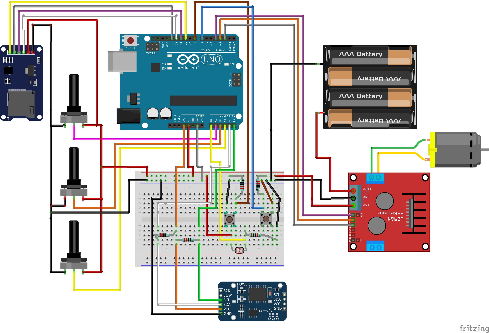

# DEV 2 -- Upgrade du système en ajoutant une contrainte de 
## 1/ Introduction
Quatrième étape, ajouter un moyen de contrôler le travail de la porte à poules. Ici, je propose l'ajout d'un lecteur de carte SD. Le système écrira dans un fichier "log.csv" les informations d'heure et de date d'ouverture et de fermeture de la porte. Ainsi que 3 paramètres suplémentaires (Heure d'ouverture, Heure de fermeture et l'intensité lumineuse au moment de la fermeture.)^

</br></br>
## 2/ Matériel et fournitures nécessaire
### 2.1 Fournitures
|Dénomination|Visuel|Où se fournir ?|Qt|
|------|------|-----|--|
|Arduino UNO||Conrad / RS components|1|
|Contrôleur moteur - Module L298N||Conrad / RS components|1|
|Moteur DC (1,5-3v et son reducteur)||RS components|1|
|Module horloge RTC DS3231||Conrad / RS components|1|
|Module porte carte SD et SDHC *notes : ce modèle contient un convertisseur de tension permettant de l'alimenter en 5V comme en 3,3v*||Conrad / RS components|1|
|Carte Micro SD||Conrad / RS components|1|
|Résistances 1Kohm ou autre valeur|||4|
|Résistances 10Kohm|||1|
|Boutons poussoirs|||2|
|Photo-résistance|||1|
|Batterie 9V ou Bloc piles 9v et pile||Conrad / RS components|1|
|Potentiomètres||Conrad / RS components|3|
|Breadbord|||1|
|Fils de breadbord mâle-mâle et femelle-mâle||||

### 2.2 Matériel
 - Ordinateur
 - [Logiciel Arduino IDE](https://www.arduino.cc/en/software)
 - Câble USB type B vers USB. 

</br></br> 
## 3/ Réalisation
### 3.1 Hardware
Réaliser le circuit représenté ci dessous. Le fichier fritzing est disponible dans le dossier "hardware" du dépôt.



### 3.2 Software
Le code suivant se trouv aussi au format ".ino" dans l'archive dans le dossier "software" sous le nom de "dev_mot_et_rtc.ino".

Flasher au moyen d'Arduino IDE le code suivant :

```cpp
//Librairies
#include <Wire.h>  
#include "DS3231.h"
#include <SPI.h>
#include <SD.h>

RTClib RTC;
DS3231 Clock;

// Branchements des composants
int enA = 4; //EnA du controleur moteur
int in1 = 3; //in1 du controleur moteur
int in2 = 2; //in2 du controleur moteur
int pin_buttonA = 7; // port numérique lié au bouton poussoir 1
int pin_buttonB = 8; // port numérique lié au bouton poussoir 2
int photoR = A0; // Port Analogique de la photo-résistance
int PotHouv = A1; //Port analogique du potentiomètre 1
int PotHferm = A2; // Port analogique du potentiomètre 2
int PotLum = A3; // Port analogique du potentiomètre 3
const int pinBranchementCS = 10; // Le « 10 » indiquant ici que la broche CS (SS) du lecteur de carte SD

//Paramètres de déclenchements de la porte
int Mouv = 0; // Minute d'ouverture
int Mferm = 0; // Minute de fermeture
int vPotHouv = 0;      // Variable où on stock la valeur du potentiomètre
int vPotHferm = 0;      // Variable où on stock la valeur du potentiomètre
int vPotLum = 0;      // Variable où on stock la valeur du potentiomètre
float Houv = 8;  // Variable où on stock l'heure d'ouverture
float Hferm = 20;  // Variable où on stock l'heure de fermeture
float LumD = 20;  // Variable où on stock le seuil de lumière qui sera utilisé
const char* nomDuFichier = "log.csv"; // Nom du log sur carte SD
File monFichier;

//Introduction de variables
int Year;
int Month;
int Date;
int Hour;
int Minute;
int Second;
int interval = 1;
int Minute_last;
int Date_last;
int i;  //i permettra à l'arduino de savoir si il fait jour ou nuit
int PR; // Varible qui stockera la valeur de la photorésistance


void setup()
{
  Serial.begin(9600); //Initialise le moniteur série
  Wire.begin(); //Initialisation du bus I2C
  SD.begin(pinBranchementCS); // démarre le lecteur de carte SD
  
  // Defini tous les ports du controleur moteur comme des sorties
  pinMode(enA, OUTPUT);
  pinMode(in1, OUTPUT);
  pinMode(in2, OUTPUT);
  analogWrite(enA, 255); 
  DateTime now = RTC.now();
  Minute = now.minute();
  
  // cette fonction va permettre de determiner si il fait jour ou si il fait nuit et de définir i en conséquence. 
  if (Hour >= Houv && Hour <Hferm) {
    i = 1 ; // I prend 1 ce qui veut dire qu'il fait jour
  }
  else {
    i = 0 ; // I prend 0 ce qui veut dire qu'il fait nuit
  }
}
void loop()
{  
  delay(1000);
  PR = analogRead(photoR); // On lit la valeur de la photo-resistance
  vPotHouv = analogRead(PotHouv); // on lit la valeur du potentiometre 1 
  vPotHferm = analogRead(PotHferm); // on lit la valeur du potentiometre 2
  vPotLum = analogRead(PotLum); // on lit la valeur du potentiometre 3
  Houv = ((vPotHouv*7.00/1023.00)+3); // Calcul de l'heure d'ouverture
  Hferm = ((vPotHferm*7.00/1023.00)+16); // Calcul de l'heure de fermeture
  LumD = ((vPotLum*400.00/1023.00)+623); // Calcul du seuil de luminosité 
  affichage();
  
  if (Hour >= Houv && Hour < Hferm && i == 0 && PR > LumD) { // Si l'heure est supérieur à l'heure minimale d'ouverture et que la porte est fermé
      ouverture(); // Ouverture de la porte
   }
  if (Hour >= Hferm && Hour > Houv && i == 1 && PR < LumD) { // Si l'heure est supérieur à l'heure minimale de fermeture et que la porte est fermé
      fermeture(); // Ouverture de la porte
   }
  DateTime now = RTC.now();
  Year = now.year();
  Month = now.month();
  Date = now.day();
  Hour = now.hour();
  Minute = now.minute();
  Second = now.second();
}

// Fonction permettant l'ouverture de la porte
void ouverture(){
  monFichier = SD.open(nomDuFichier, FILE_WRITE);
  if (monFichier) {
    monFichier.print("ouverture");
    monFichier.print(";");
    monFichier.print(Year);
    monFichier.print("-");
    monFichier.print(Month);
    monFichier.print("-");
    monFichier.print(Date);
    monFichier.print(";");
    monFichier.print(Hour);
    monFichier.print(":");
    monFichier.print(Minute);
    monFichier.print(";");
    monFichier.print(Houv);
    monFichier.print(";");
    monFichier.print(Hferm);
    monFichier.print(";");
    monFichier.println(PR);
    monFichier.close(); // Fermeture du fichier
    Serial.println("Ecriture terminee.");
  }
  else {
    Serial.println(F("Echec d'ouverture en ecriture, sur la carte SD !"));
  }
  Serial.println();
  Serial.print("Ouverture de la porte...");
  while (digitalRead(pin_buttonA) == HIGH){ // Tant que le bouton est en position High, le moteur tourne
      //le moteur tourne
      digitalWrite(in1, HIGH);
      digitalWrite(in2, LOW);
  }
  Serial.println();
  Serial.print("Porte ouverte ;-)");
  digitalWrite(in1, LOW);
  digitalWrite(in2, LOW);
  i = 1; // I defini l'etat d'ouverture de la porte, ici i prend la valeur 1 ce qui signifie que la porte est ouverte
  delay(1000);
}

// Fonction permettant la fermeture de la porte
void fermeture(){
    monFichier = SD.open(nomDuFichier, FILE_WRITE);
  if (monFichier) {
    monFichier.print("fermeture");
    monFichier.print(";");
    monFichier.print(Year);
    monFichier.print("-");
    monFichier.print(Month);
    monFichier.print("-");
    monFichier.print(Date);
    monFichier.print(";");
    monFichier.print(Hour);
    monFichier.print(":");
    monFichier.print(Minute);
    monFichier.print(";");
    monFichier.print(Houv);
    monFichier.print(";");
    monFichier.print(Hferm);
    monFichier.print(";");
    monFichier.println(PR);
    monFichier.close(); // Fermeture du fichier
    Serial.println("Ecriture terminee.");
  }
  else {
    Serial.println(F("Echec d'ouverture en ecriture, sur la carte SD !"));
  }
  Serial.println();
  Serial.print("Fermeture de la porte...");
  while (digitalRead(pin_buttonB) == HIGH){ // Tant que le bouton est en position High, le moteur tourne
      //le moteur tourne
      digitalWrite(in1, LOW);
      digitalWrite(in2, HIGH);
  }
  Serial.println();
  Serial.print("Porte ferme ;-)");
  digitalWrite(in1, LOW);
  digitalWrite(in2, LOW);
  i = 0;
  delay(1000);
}

// Fonction permettant l'affichage des données sur le moniteur serie
void affichage() {
  Serial.println();
  Serial.print("Date: ");
  Serial.print(Year);
  Serial.print("/");
  Serial.print(Month);
  Serial.print("/");
  Serial.print(Date);
  Serial.print(" ");
  Serial.print(Hour);
  Serial.print(":");
  Serial.print(Minute);
  Serial.print(":");
  Serial.print(Second);
  Serial.println();
  Serial.print("Parametres: ");
  Serial.print(Houv);
  Serial.print("  ");
  Serial.print(Hferm);
  Serial.print("  ");
  Serial.print(LumD);
  Serial.println();
  Serial.print("Valeur actuel de la Photo-resistance : ");
  Serial.println(PR);
  Serial.print("Valeur de i : ");
  Serial.println(i);
}
```

</br></br>
## 4/ Références et développement. 
Toutes le informations à propos du branchement et de l'usage du module porte carte SD viennent d'un [excellent tutoriel de Passion electronique](https://passionelectronique.fr/carte-sd-arduino/)

**Branchements :** 

|Module lecteur SD|Uno|Nano|Mega|
|------|------|------|------|
|**Broche CS**|D10|D10|53|
|**Broche SCK**|D13|D13|52|
|**Broche MOSI**|D11|D11|51|
|**Broche MISO**|D12|D12|50|
|**Broche VCC**|5v|5v|5v|
|**Broche GND**|GND|GND|GND|

La librairie utilisé est "SD.h" une librairies installé par défaut avec Arduino IDE. Donc aucune installation de librairie n'est nécessaire.

La présente documentation ne traite que l'écriture sur la carte SD, pour la lecture, consulter le tutoriel dont le lien figure plus haut. 

On commence par déclarer les librairies utilisés : 
```cpp
#include <SPI.h>
#include <SD.h>
```

Puis il faudra initialiser la classe "SD". Egalement il ser nécéssaire de préciser le branchement de la PIN CS (ou SS), ici sur D10. 
```cpp
const int pinBranchementCS = 10; // Le « 10 » indiquant ici que la broche CS (SS) de votre lecteur de carte SD est branché sur la pin D10 de votre Arduino
SD.begin(pinBranchementCS); // Cette fonction retournere "True" si l'initialisation est ok. Elle pourra être utilisé pour générer un message d'erreur. 
```

Pour finir dans init, il faudra déclarer la variable "nomDuFichier" :
```cpp
const char* nomDuFichier = "log.csv"; // Nom du log sur carte SD
```

De plus, il faudra dans le ```void loop``` éxecuter une fonction "open". Cette fonction renverra une erreur si l'on essaye d'ouvrir un fichier en lecture qui n'existe pas. Mais en écriture dans le cas où le fichier n'existe pas il le créera. 
```cpp
SD.open(nomDuFichier, FILE_WRITE); // Ouvr en écriture
SD.open(nomDuFichier, FILE_READ); // Ouvre en lecture
```

Attention, lorsqu'un fichier n'est plus utilisé, il faut le refermer. On utilise pour cela la fonction "close".
```cpp
SD.close();
```

Voilà ce que donne une section d'écriture de texte dans le fichier en question : 

```cpp
    monFichier.print("ouverture");
    monFichier.print(";");
    monFichier.print(Year);
    monFichier.print("-");
    monFichier.print(Month);
    monFichier.print("-");
    monFichier.print(Date);
    monFichier.print(";");
    monFichier.print(Hour);
    monFichier.print(":");
    monFichier.print(Minute);
    monFichier.print(";");
    monFichier.print(Houv);
    monFichier.print(";");
    monFichier.print(Hferm);
    monFichier.print(";");
    monFichier.println(PR);
    monFichier.close();   
```
Ici j'écris une ligne dans un csv séparé par des ";" pour pouvoir par la suite analyser ces données et faire des statistiques. 

</br></br>
## 5/ Améliorations
 - Ajouter un écran LCD pour donner l'heure des dernières ouvertures, fermetures et valeur de lumière. 
 - Si la lecture de l'intensité lumineuse pose un problème, peut-être étudier des techniques de lissage de courbe tel qu'utiliser une moyenne glissante, [comme documenté ici](https://www.aranacorp.com/fr/implementation-de-la-moyenne-glissante-dans-arduino/#:~:text=Le%20principe%20de%20la%20moyenne,l'%C3%A9tablissement%20de%20la%20moyenne.).
