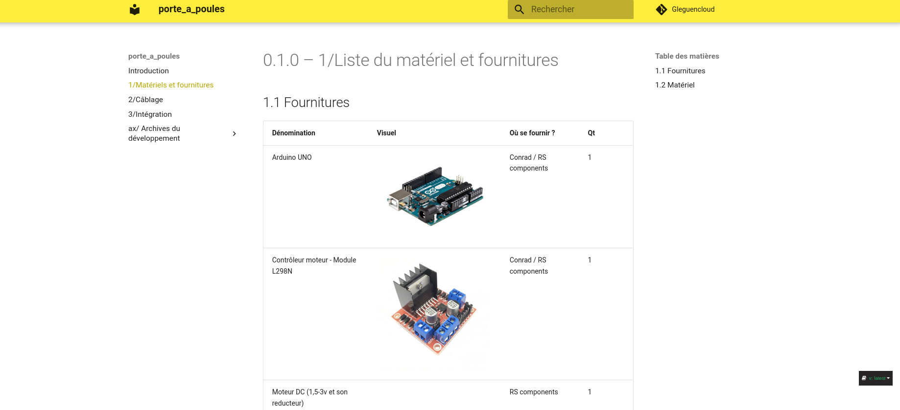

# Éditer cette documentation

## 1/ Introduction
|||
|-|-|
|Cette documentation est mise en page par ReadTheDocs.org et [lisible à l'adresse ci attaché](https://porte-a-poules.readthedocs.io/fr/latest/). En aucun cas, cette adresse permet d'éditer la documentation.||
|Afin de pouvoir contribuer à cette documentation, vous pouvez contribuer directement au [repository GitHub](https://github.com/gheleguen/porte_a_poules).||

C'est sur GitHub que sont déposés les fichiers sources. On y retrouve l'arborescence suivante : 

 - **docs :** Est le dossier qui contient les documents qui pourront être affichés sur le read the doc. Dans ce dossier sont entreposés :

   - A la racine les fichiers marckdown qui sont les textes de la documentation. Pour chaque onglet sur read the doc nous ajouterons un fichier séparé avec un titre en Anglais sans espaces terminé par "_fr" pour la version française ou "_en" pour le version anglaise. L'extention sera toujours ".md".
   - Le dossier "pictures" : Qui contient plusieurs dossiers dont chacun porte un nom en rapport avec le fichier marckdown auquel il se rapporte. Ainsi pour un fichier de doccumentation "test1_fr.md" on prendra le soin d'entreposer les images dans un dossier "/docs/pictures/test1".

 - **Hardware :** Qui est le dossier qui contient les fichiers d'impressions 3D, de découpe laser...  

Avant de faire une proposition de contribution, il est bienvenue d'éditer le repository depuis votre compte en effectuant un forke de la présente documentation. Une fois que vous aurez une version prête à être publiée il suffira de faire une pull request au "main project".
C'est un administrateur qui étudiera votre proposition pour en intégrer tout ou partie sur le projet. 


## 2/ Édition (généralités)
Ces actions peuvent se réaliser directement sur la plateforme gilhub.

### 2.1 Écriture en Marckdown
Le Marckdown est un langage de mise en forme de texte très simplifié. On peut éditer un fichier ".md" directement via gitHub ou en local de son ordinateur avec n'importe quel éditeur de texte. Cependant nous recommandons [Ghostwriter](https://ghostwriter.kde.org/fr/) qui présente l'avantage de proposer une vue en direct du rendu (aperçu HTML).

[Pour ce qui est de la syntaxe, consulter ce guide](https://www.markdownguide.org/basic-syntax/)


### 2.2 Ajout et mise à jour d'une image

#### 2.2.1 Ajout
Les images que l'on souhaite faire apparaître dans la documentation ne doivent pas être collées dans le document. 

 - Importer les images désirées que l'on aura préalablement réduites en taille chacune en dessous de 200Ko et renommées de manière à être facilement identifiables. 
 - Dans le fichier de documentation corespondant à la ligne où l'on souhaite faire apparaître l'image, ajouter la ligne suivante : 
 `````` 


#### 2.2.2 Mise à jour 
Pour mettre à jour une image, il suffit de supprimer du git l'image en question et d'uploader la nouvelle image en prenant soin de renommer cette nouvelle image avec le nom exact de l'ancienne. 


## 3/ Édition du dépôt en locale (Intermédiaire)
Cette méthode permet de cloner l'archive disponible sur github sur un disque dure. Ainsi on pourra facilement modifier les différents fichiers mais aussi l'arborescence sans nécéssiter de connexion internet mais surtout cela va permettre de préparer une version qui pourra par la suite faire l'objet d'un pull request. 
Toute la démarche décrite ci-dessous est valable uniquement pour un usage depuis un ordinateur sous Linux. Il existe nécessairement des équivalent pour les autres OS mais les lignes de commandes restent les même.

### 2.1 Installer Git et préparer le terrain
 - Sur votre disque dure, définir l'espace où sera stocké le dépôt. Sachez qu'un dépôt GitHub peut peser jusq'à 500Mo. De préférence définir un dossier vide. **Attention* A ce qu'aucun dossier ou sous-dossier du chemin ne comporte de caractères spéciaux ou d'espaces. Remplacer tous les espaces par des underscore "_". 
 - Ouvrir un terminal (*Ctrl + Alt + t* sur Unbuntu).
 - Dans le cas où le paquet "git" n'est pas déjà installé sur votre PC, lancez l'installation de git :  ```sudo apt install git``` (Cette action nécessite une connexion internet).
 

### 2.2 Cloner le dépôt sur son disque dure
 - Ouvrir une page web avec le github que l'on souhaite cloner
 - Y copier le code "https" que l'on trouvera dans l'onglet déroulant "code" en haut à droite.
 - Dans un terminal se diriger vers l'espace prévu pour coller le dépôt. Utiliser la commande ```cd puis_chemin/de_votre_dossier```
 - Cloner le dépôt git en utilisant la commande ```git clone https://github.com/identifiant/nom_du_projet.git``` Prendre soin de remplacer l'url par celui du dépôt désiré si il est différent du notre. 
 - Le clonage va prendre quelques minutes et va coller tous les fichiers et l'arborescence dans votre répertoire.


### 2.3 Modifier le dépôt
 - Sur votre poste de travail, modifiez tous les fichiers nécessaires, déposer des fichiers, suprimez en...
 - Avant de commencer à travailler peut-être que le dépôt en ligne a été modifié depuis votre dernière mise à jour. Pour mettre à jour votre dépôt en local. Se positionner tout d'abord dans le dépôt ```cd NomduDepot``` Puis effectuer un "Pull" ```git pull```
 
### 2.4 Proposer des modifications
Si vous avez effectué des modifications, il peut-être utile de les proposer en modification au projet. Mais avant cela il peut-être utile de créer une nouvelle branche ou de faire cela depuis votre fork. 
 - Pour ajouter l'ensemble des fichiers à la liste des fichiers à commiter : ```git add *```
 - Commiter ```git commit -m "commentaire associé au commit" git@git.cru.fr:nom_projet.git nom_branche (par défaut master représentant la branche principale)```
 - Enfin pousser votre travail ```git push```


 
## Liens connexes
 - [Documentation Git](https://git-scm.com/about)
 - [Formation vidéo à Git](https://youtube.com/playlist?list=PLjwdMgw5TTLXuY5i7RW0QqGdW0NZntqiP)
 
 
